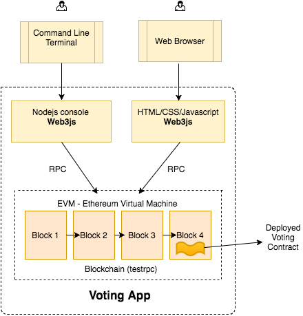

# Walletchain

This project wants to create a simple job wallet for a universal worker.

We use a smart contract example to maintain workers history.

Warning: From solidity documentation:

-- Everything that is inside a contract is visible to all external observers. Making something private only prevents other contracts from accessing and modifying the information, but it will still be visible to the whole world outside of the blockchain.

## Settings

Here we define some tools to set up our application. 

### Starting TestRPC

```sh
	node_modules/.bin/testrpc
```



	testrpc is a in-memory blockchain for test purpose.

### Modules  

To interact with it, we add Web3 module, an Ethereum JavaScript API and solc, a solidity compiler. This allows us to make a fake ethereum environment. 

```Javascript
	Web3 = require('web3')

	web3 = new Web3(new Web3.providers.HttpProvider("http://localhost:8545"));

	solc = require('solc')
```

### Creating your Wallet

Main commands for compile and set a smart contract.

```Javascript
	var contractwl = 'wallet.sol'; var namewl = ':Wallet';
	compiledCodewl = solc.compile(fs.readFileSync(contractwl).toString())
	abiDefinitionwl = JSON.parse(compiledCodewl.contracts[namewl].interface)
	wlContract = web3.eth.contract(abiDefinitionwl)
	byteCode = compiledCodewl.contracts[namewl].bytecode		
```

To keep the worker information safe, we took js-sha256, another nodejs module, and hash the data, to attach into his wallet.

```Javascript
	// calculate the hash function
	var sha256 = require('js-sha256');
	var hash = sha256.hmac.create('123890');
	var info = { name: "Luis Antonio", rg:"4678990", cpf: "45789076544" }
	hash.update(JSON.stringify(info));
```

Now we make the contract deploy on testRPC. When you make your deploy, we have to spend some gas, to maintain the Ethereum Virtual Machine.

```Javascript
	deployedContractwl = wlContract.new(hash.hex(), {data: byteCode, from: web3.eth.accounts[0], gas: 4700000})
	contractInstancewl = wlContract.at(deployedContractwl.address)
```

In the next step, we show the possibility to update our worker information in his wallet, if the worker wants to.

```Javascript
	info.email = "luiz.antonio@gmail.com";

	var hash2 = sha256.hmac.create('456987');
	hash2.update(JSON.stringify(info));

	contractInstancewl.updateHashData(hash2.hex(), {from: web3.eth.accounts[0], gas:100000})

	contractInstancewl.getHashData.call()
```

## Putting a new contract on the Wallet

Like the wallet creation, we need a simple contract, created by a company. 

```Javascript
	var contractjc = 'job_contract.sol'; var namejc = ':JobContract';
	compiledCodejc = solc.compile(fs.readFileSync(contractjc).toString())
	abiDefinitionjc = JSON.parse(compiledCodejc.contracts[namejc].interface)
	jcContract = web3.eth.contract(abiDefinitionjc)
	byteCode = compiledCodejc.contracts[namejc].bytecode
	deployedContractjc = jcContract.new(5,{data: byteCode, from: web3.eth.accounts[1], gas: 4700000})
	contractInstancejc = jcContract.at(deployedContractjc.address)

```

If you want to add a new pending contract on worker's wallet, you need to inform the contract address when you submit into the worker's wallet, the company account, and pay some gas.

```Javascript
	contractInstancewl.addContract(deployedContractjc.address,{from: web3.eth.accounts[1], gas:100000})
```

Now we have a new contract on pending array, we can see with this command:

```Javascript
	// try to view contract pendings with another user
	contractInstancewl.getPendings.call({from: web3.eth.accounts[1]});
	// with the owner
	contractInstancewl.getPendings.call({from: web3.eth.accounts[0]});
```

And finally, when the worker validate the contract, he can put it into his definitely contracts list.

```Javascript
	contractInstancewl.promoteContract(deployedContractjc.address, {from: web3.eth.accounts[0], gas:100000});
```

Show contract on contract's array:

```Javascript
	// all people have access to contract's array
	contractInstancewl.getContracts.call({from: web3.eth.accounts[1]});
```

